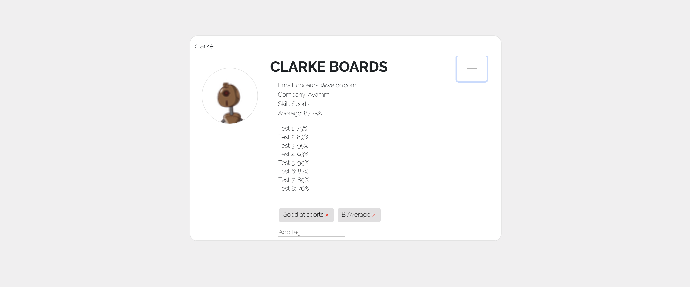

# Student Profiles

## Description 
This application uses an API to display data which can then be filtered by student names and each student's information is displayed. A user is able to add or delete tags to any student card. This application was built using React and React Hooks. 

## Table of Contents
* [Installation](#installation)
* [Usage](#usage)
* [Contributing](#contributing)
* [Tests](#tests)
* [Questions](#questions)

## Installation 
This application uses node and all dependencies are installed by running `npm install`. To run the server run `npm start` in the terminal. This application runs on localhost:3000. 

## Usage 
This application will allow users to view the current song in the playlist and the next songs in the queue. Users will also be able to view top artists and search through artists. 

## Contributing 
Contributors should read the installation section. 

## Tests
No tests are used in this application.

## Questions
If you have any questions about this projects, please contact me directly at nicole.elisaw@gmail.com. You can view more of my projects at https://github.com/nicolewallace09.